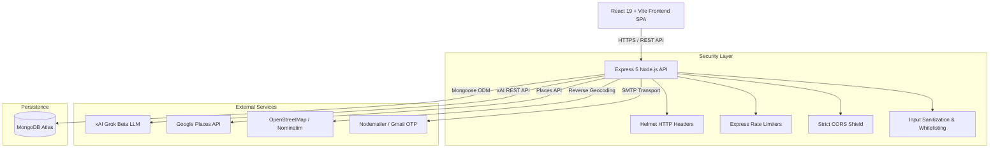

# ✦ EventEase 🦉

<div align="center">


**One Dashboard. Zero Chaos. Unforgettable Small & Medium Events.**

[](https://react.dev)
[](https://vitejs.dev)
[](https://nodejs.org)
[](https://expressjs.com)
[](https://mongodb.com)
[](https://x.ai)
[](#-security--privacy-shield)

---

### 🦉 Meet **Easey the Owl** — Your 3D Smart Event Companion!
*From roaming your screen to calculating budget math with Grok AI, Easey makes party planning fun, playful, and budget-smart.*

</div>

---

## 🌟 Overview

**EventEase** is a full-stack, neo-brutalist web application designed to take the stress out of event planning. While traditional platforms focus on oversized $50k+ destination weddings, EventEase specializes in **small-to-medium scale celebrations** — house parties, micro-weddings, casual family BBQs, birthday bashes, and baby showers.

It combines intelligent AI estimation, live local vendor search via Google Places, real-time budget tracking, guest RSVP management, and selective user privacy safeguards into a single, high-energy interactive hub.

---

## ✨ Key Features & Highlights

### 🤖 1. Grok AI Quotation & Planning Engine
- **Smart Math Allocation**: Input your budget and guest count — our backend powered by **xAI Grok** computes accurate category allocations (Catering, Decor, Sound/Venue, Extras, Emergency Buffer) based on your selected experience level (*Budget*, *Standard*, *Premium*).
- **Personalized Tips**: Easey the Owl generates 2 custom, witty, actionable party tips tailored to your specific dietary notes, timing, location, and guest list.

### 📍 2. Live Vendor Marketplace & Foursquare / Google Places Integration
- **Real Local Business Lookup**: Search for vendors in any city (e.g. *Delhi, Mumbai, Kolkata*) or category (*Flowers, DJ, Catering, Salon & Makeup, Photography*).
- **Foursquare & Google Places Proxy**: Integrates Foursquare Places API (`api.foursquare.com/v3`) and Google Places API to fetch real business listings, category tags, ratings, and direct Google Maps directions.
- **Resilient Multi-Tier Fallback**: Automatically cascades from Foursquare Places → Google Places → OpenStreetMap Nominatim live search, guaranteeing search results are never empty.

### 🛡️ 3. Security & Selective Vendor Privacy
- **Selective Info Controls**: Personal phone, email, and location are protected by default and strictly revealed only to vendors that users explicitly favorite/save.
- **Security Hardened**: Protected against CORS exploits, mass assignment (IDOR), XSS injection, account enumeration, timing attacks, and API credit exhaustion.

### 📊 4. Interactive Event Command Center
- **Budget Manager**: Track paid vs. pending vendor expenses with interactive category breakdowns.
- **Guest List Manager**: Filter RSVPs (Confirmed, Pending, Declined), track dietary restrictions, plus-ones, and table assignments.
- **Reviews & Feedback**: Submit and manage authentic vendor ratings tied to your organized events.

### 🎨 5. Bold Neo-Brutalist Design System
- High-contrast typography, crisp offset shadows (`box-shadow: 4px 4px 0 #1E1E1E`), glassmorphism cards, and an interactive 3D mascot.

---

## 🏗️ Architecture Overview



---

## 🛠️ Tech Stack

### **Frontend**
- **Framework**: React 19 + Vite 8
- **State & Query**: TanStack Query (React Query v5) + Context API
- **Routing**: React Router v7
- **Styling**: Tailwind CSS + Custom Brutalist Design Tokens
- **Icons**: Lucide React Icons
- **HTTP Client**: Axios

### **Backend**
- **Runtime**: Node.js v22
- **Framework**: Express.js 5.x
- **Database**: MongoDB Atlas via Mongoose 9.x
- **AI Service**: xAI Grok API (`api.x.ai/v1`)
- **Security**: Helmet, Express Rate Limit, bcryptjs, jsonwebtoken, Validator.js
- **Mailer**: Nodemailer

---

## 🛡️ Security & Privacy Shield

| Security Feature | Implementation Detail |
|---|---|
| **Rate Limiting** | Strict IP/User rate limits on Auth (10 req/15min), Forgot Password (5 req/hr), and AI Endpoints (20 req/hr). |
| **Mass Assignment Protection** | Strict whitelist filtering (`pickAllowed()`) on all `POST`/`PUT` endpoints to prevent `userId` override or prototype pollution. |
| **Authentication & Tokens** | JWT auth with mandatory `JWT_SECRET` verification. Password hashing using `bcryptjs` with 12 rounds. |
| **Timing Attack Mitigation** | Constant-time string comparison (`crypto.timingSafeEqual`) for 6-digit OTP verification. |
| **Account Enumeration Prevention** | Generic error messages for authentication failures + dummy bcrypt comparison cycles. |
| **XSS & Injection Defense** | Input sanitization using `validator.trim()` and strict URL scheme checks (`http`/`https` only for avatars). |
| **Selective Privacy** | User contact details are hidden until the user explicitly saves/favorites a vendor. |

---

## 🔌 API Endpoint Documentation

### 🔑 Authentication (`/api/auth`)
- `POST /api/auth/register` — Create a new host account (rate limited).
- `POST /api/auth/login` — Authenticate and receive a JWT.
- `POST /api/auth/forgot-password` — Request a 15-minute 6-digit OTP.
- `POST /api/auth/verify-otp` — Verify password reset OTP.
- `POST /api/auth/reset-password` — Set a new password using verified OTP.
- `GET /api/auth/me` — Fetch current user profile details.

### 🤖 AI Service (`/api/ai`)
- `POST /api/ai/calculate-quotation` — *(Auth Required)* Compute AI budget breakdown & Grok planning tips.

### 🛍️ Vendor Marketplace (`/api/vendors`)
- `GET /api/vendors` — Public catalog search with live Google Places API & OSM location fallback.
- `GET /api/vendors/saved` — *(Auth Required)* Get user's saved favorite vendors.
- `POST /api/vendors/save` — *(Auth Required)* Save a vendor to favorites.
- `DELETE /api/vendors/save/:vendorId` — *(Auth Required)* Remove a vendor from saved.

### 📅 Events & Management
- `GET/POST /api/events` — Manage user events.
- `GET/PUT/DELETE /api/events/:id` — Operation scoped to owner's events.
- `GET/POST/PUT/DELETE /api/budget` — Manage total budget & expense items.
- `GET/POST/PUT/DELETE /api/guests` — Manage guest list and RSVPs.
- `GET/POST/PUT/DELETE /api/reviews` — Manage vendor reviews.

---

## 🚀 Local Setup & Installation

### Prerequisites
- **Node.js**: v20.x or v22.x
- **MongoDB**: Local MongoDB instance or MongoDB Atlas URI

### 1. Clone the Repository
```bash
git clone https://github.com/btw-saanvi/EventEase.git
cd EventEase
```

### 2. Backend Configuration
```bash
cd backend
npm install
```

Create a `backend/.env` file:
```env
MONGODB_URI=mongodb+srv://<username>:<password>@cluster.mongodb.net/eventease
JWT_SECRET=your_super_secret_jwt_key_here
PORT=5000

# API Keys
GROK_API_KEY=gsk_your_xai_grok_api_key
FOURSQUARE_API_KEY=WLPU4XXKNE5AHRAL3XHPXMIWDYBDJLAO3VDU0ROD0PVFSFP3
GOOGLE_PLACES_API_KEY=your_google_places_api_key

# Nodemailer OTP Settings (Optional)
EMAIL_USER=your_email@gmail.com
EMAIL_PASS=your_gmail_app_password
```

Start the backend server:
```bash
npm run dev
```

### 3. Frontend Configuration
Open a new terminal window:
```bash
cd frontend
npm install
```

Create a `frontend/.env` file:
```env
VITE_API_URL=http://localhost:5000/api
VITE_GOOGLE_CLIENT_ID=your_google_client_id
```

Start the Vite development server:
```bash
npm run dev
```

Visit **`http://localhost:5173`** in your browser! 🎉

---

## ☁️ Deployment Guide (Vercel)

1. Import this repository into **[Vercel](https://vercel.com)**.
2. Keep the **Root Directory** as `./` (repo root).
3. Set the following environment variables in Vercel:

| Environment Variable | Target | Description |
|---|---|---|
| `MONGODB_URI` | Backend | MongoDB Atlas Connection String |
| `JWT_SECRET` | Backend | Secret key for JWT signing |
| `GROK_API_KEY` | Backend | xAI Grok API Key for AI features |
| `GOOGLE_PLACES_API_KEY` | Backend | Google Places API Key |
| `VITE_API_URL` | Frontend | Set to `/api` for Vercel serverless proxy |

---

## 📄 License & Attribution

- **Author**: Built with ❤️ by **Saanvi Garg**.
- **Inspiration**: UI layout and flow inspired by modern web design & brutalist aesthetics.
- **License**: Personal project & portfolio showcase. All rights reserved.
